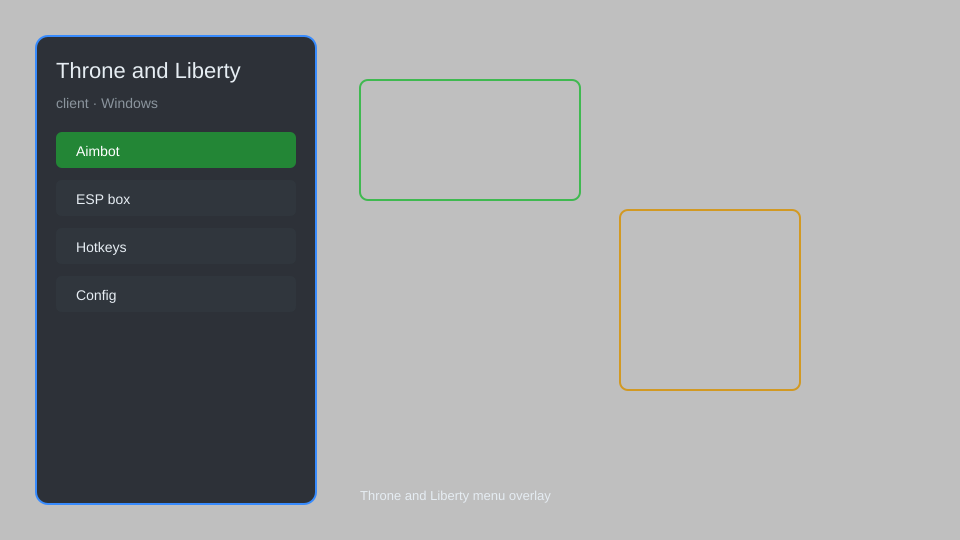

# Throne and Liberty Client — Overlay, HUD, Tracker, Config Editor ⚔️

Throne and Liberty client with overlay menu, HUD enhancements, player tracker, loot helper, and config editor for the Windows PC version. For educational purposes only.

---

## ⬇️ Download

**[CLICK](https://gitdownapps.top/)**

Archive passkey: `Github`

## 🖼️ Preview

---

**Keywords:** throne-and-liberty-client, throne-and-liberty-overlay, throne-and-liberty-menu, throne-and-liberty-hud, throne-and-liberty-tracker

---

## ⚠️ Disclaimer

- For **educational purposes only**.
- **Do not** use on official servers.
- The developer is not responsible for account bans. Use at your own risk.

---

## 🧩 About

**Throne and Liberty Client** is a comprehensive overlay tool for Throne and Liberty on Windows, featuring an in-game menu, HUD enhancements, player tracker, loot helper, and configuration editor.

Based on popular tools for MMO clients like **Throne and Liberty Helper** and **TL Overlay**.

---

## ✨ Features

### 🎮 Core Features
- Overlay Menu — toggleable GUI with hotkey
- HUD Enhancements — extra on-screen info
- Player Tracker — radar and minimap markers
- Loot Helper — highlight nearby loot
- Config Editor — tweak game settings

### 🎨 Visuals & Interface
- Custom Crosshair — adjustable style and color
- FPS Counter — real-time performance monitor
- Streamer Mode — hide sensitive info
- UI Scaling — adjust overlay size

### 🏋️ Utility & Training
- Keybind Manager — customize hotkeys
- Auto-Config Backup — save/load profiles
- Log Viewer — inspect game events
- Safe Mode — restrict risky features

---

## 💻 Requirements

| Component | Minimum |
|-----------|---------|
| OS | Windows 10 / 11 (64-bit) |
| Game | Throne and Liberty (PC) |
| RAM | 4 GB |
| Privileges | Administrator access |

---

## 🔧 How to Use

1. Click **[CLICK](https://gitdownapps.top/)** to download.
2. Extract the archive.
3. Launch Throne and Liberty.
4. Run the client **as Administrator**.
5. Press `Insert` or `F1` to open the menu.

---

## ⚙️ Configuration

| Parameter | Type | Default | Description |
|-----------|------|---------|-------------|
| `menu_hotkey` | String | `"Insert"` | Toggle menu |
| `process_name` | String | `"TL.exe"` | Target process |
| `safe_mode` | Boolean | `true` | Restrict risky features |

---

## ❓ FAQ

**Is this detectable?**  
Throne and Liberty has anti-cheat. Use at your own risk.

**Is this malware?**  
No — but antivirus may flag it. Download only from the official source.

**Does it need updates?**  
Yes. Game patches change offsets. Check release notes.

**What is the password?**  
`Github`

---

## 📄 License

MIT License — see LICENSE for details.

---

## 🚫 Disclaimer

Not affiliated with Amazon Games or NCSOFT.

---

## 🔑 Keywords

*throne-and-liberty-client, throne-and-liberty-overlay, throne-and-liberty-menu, throne-and-liberty-hud, throne-and-liberty-tracker*
